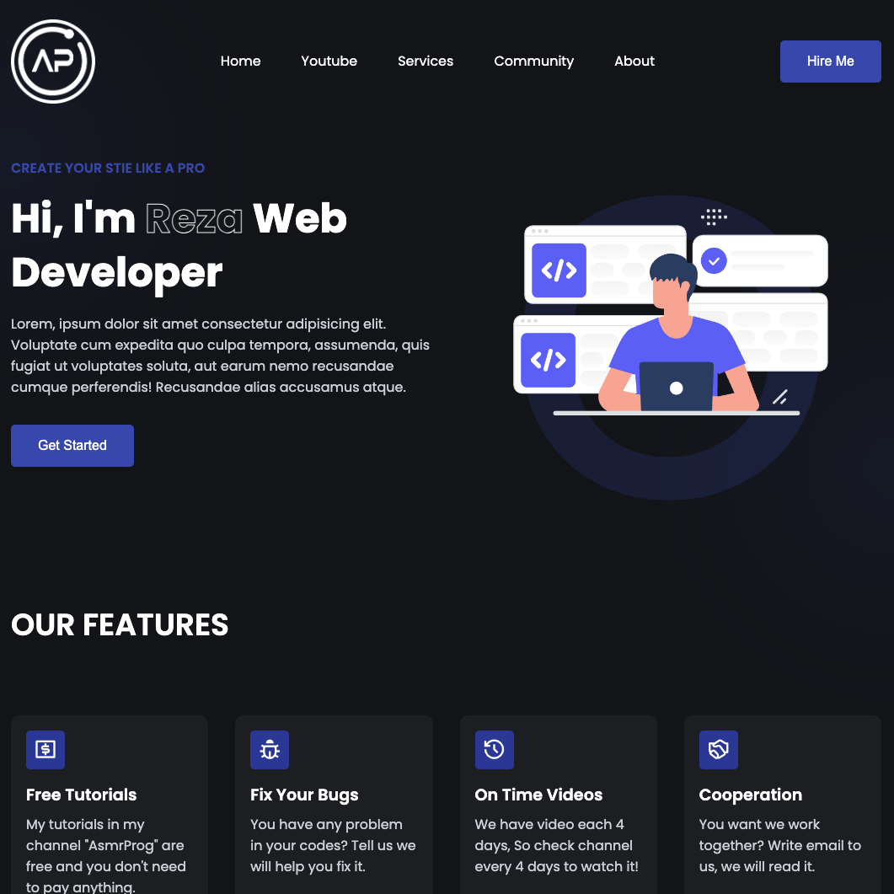

# Personal Portfolio Design #1
In this tutorial ([Open in Youtube](https://youtu.be/womd8BFIbDY)), I'm going to show you how to use modern HTML, CSS, and JavaScript to create a completely responsive Portfolio Design with Scroll To Element Functionally. We'll be using CSS Grid, CSS Flexbox, Media queries for our responsive design, and CSS  transition for some cool animation effects.

# Screenshot
Here we have project screenshot :

