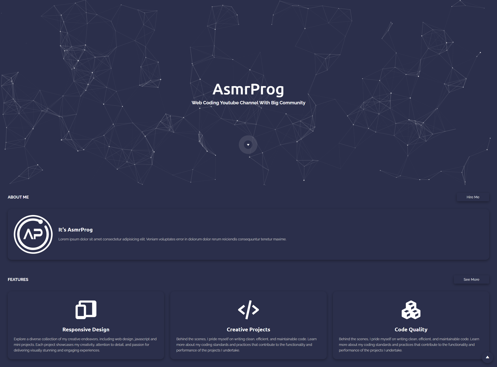

# Personal Portfolio Design #2
In this tutorial ([Open in Youtube](https://youtu.be/b5s55FzPTac)), I'm going to show you how to use modern HTML, CSS, and JavaScript to create a completely responsive Portfolio Design with Scroll To Element and Also Scroll To Top. We'll be using CSS Flexbox, Media queries for our responsive design and CSS  transition for some cool animation effects. Also we have a pulse animation in this code!

# Screenshot
Here we have project screenshot :

