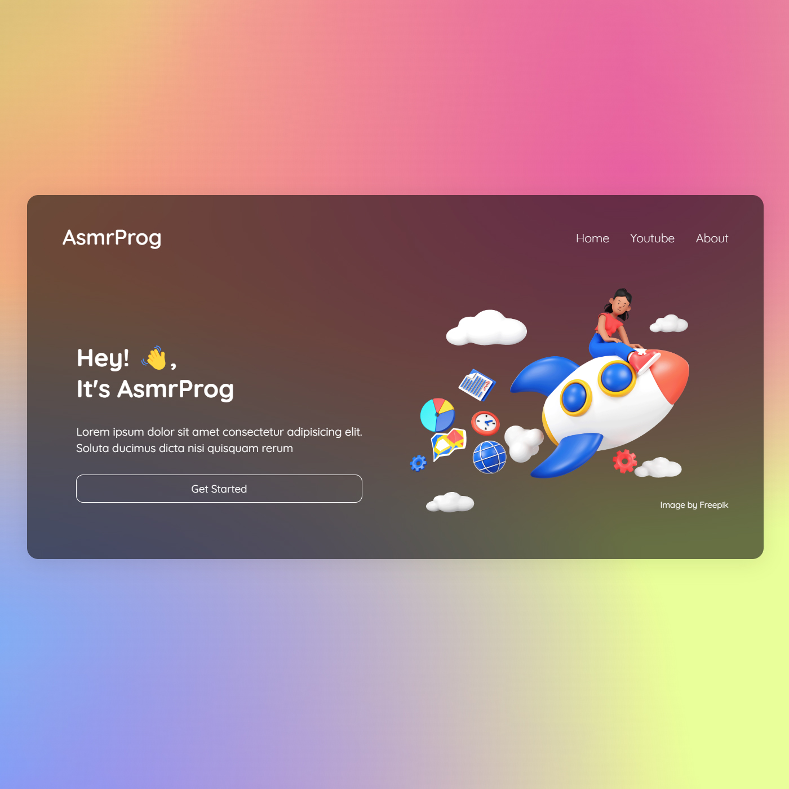

# Personal Portfolio Design #3
In this tutorial ([Open in Youtube](https://youtu.be/Nk0kiq-hss0)), I'm going to show you how to use modern HTML, CSS to create a completely responsive Portfolio Design with mesh gradient background and glassmorphism ui design. We'll be using CSS Flexbox, Media queries for our responsive design, and CSS  transition for button hover effect.

# Screenshot
Here we have project screenshot :

