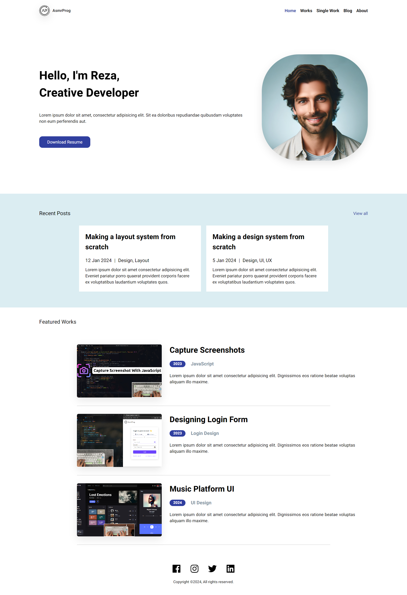
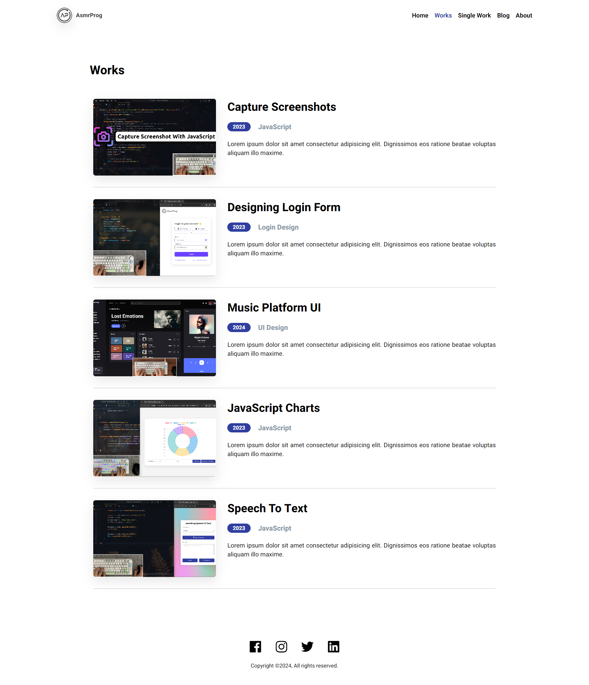
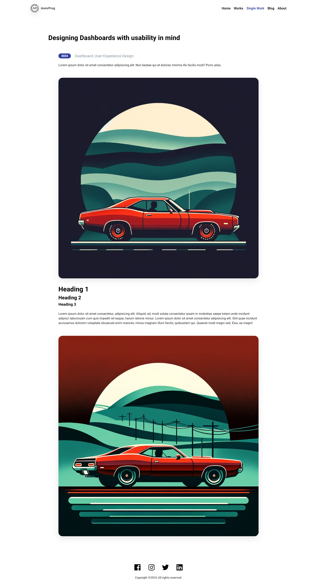
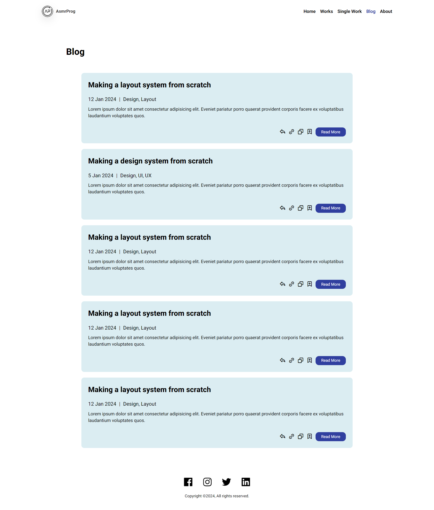
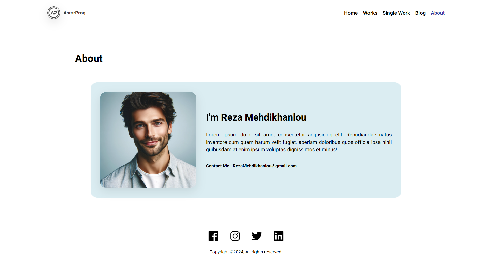

# Personal Portfolio Design #06
In this tutorial ([Open in Youtube](https://youtu.be/oU_iMhi1Ado)), I'm going to show you how to use modern HTML and CSS to create a completely responsive Multi Page Website with awesome color theme. We'll be using CSS Flexbox, Media queries for our responsive design and CSS  transition for some cool animation effects. This project have 5 pages : Home, Works, Simple-Work, Blog and About 😉

# Screenshot
Here we have project screenshot :

### Home Page

### Works Page

### Single-Work Page

### Blog Page

### About Page
