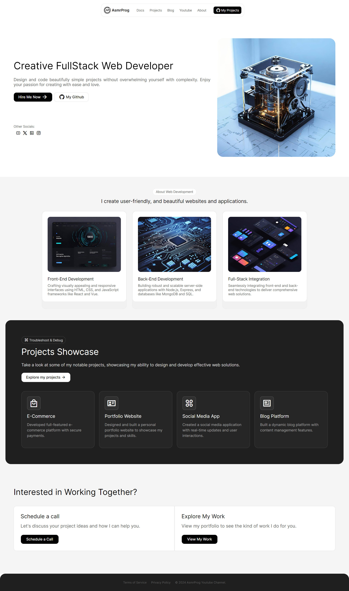

# Personal Portfolio Design #07
In this tutorial ([Open in Youtube](https://youtu.be/6kcYZPks5S4)), 🚀 Get ready to showcase your skills and projects as we dive into the world of personal portfolio websites! In this tutorial, we'll guide you through the process of building a stunning and professional portfolio using HTML and CSS. Whether you're a coding newbie or a seasoned developer, there's something here for you!

🎨 We'll start by laying the foundation with HTML, building the structure for our video call interface. Then, we'll sprinkle some CSS magic to style it up, ensuring it looks modern and professional. 💻 From sleek buttons to stylish layouts, we'll cover it all!

📱 Worried about responsiveness? Don't be! We'll show you how to make your design adapt seamlessly to various screen sizes, ensuring your portfolio looks fantastic on any device.

# Screenshot

Here we have project screenshot :

