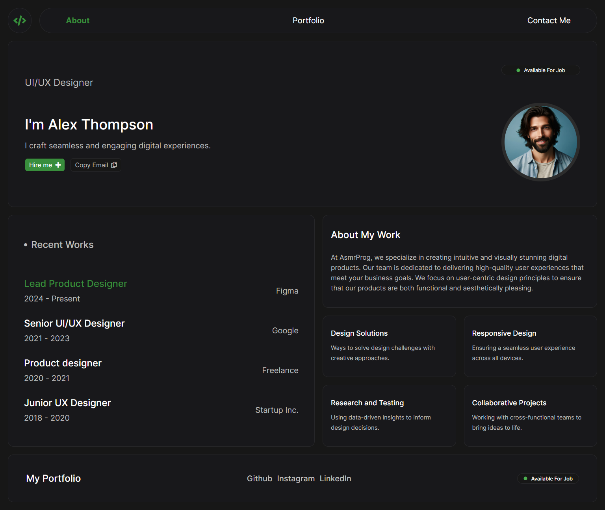

# Personal Portfolio Design #08
In this tutorial ([Open in Youtube](https://youtu.be/3Kc0NoAcqgI)), 🚀🚀 Get ready to showcase your skills and projects as we dive into the world of personal portfolio websites! In this tutorial, we'll guide you through the process of building a stunning and professional portfolio using HTML and CSS. Whether you're a coding newbie or a seasoned developer, there's something here for you!

🎨🎨 We'll start by laying the foundation with HTML, building the structure for our portfolio. Then, we'll sprinkle some CSS magic to style it up, ensuring it looks modern and professional. 💻 From sleek buttons to stylish layouts, we'll cover it all!

What You'll Learn:
- Setting up the basic structure of your HTML file
- Styling your portfolio with CSS to achieve a modern look
- Creating a responsive design that looks great on all devices
- Adding a professional touch with custom fonts and colors
- Implementing an interactive 'Hire me' button

Features of the Portfolio:
- Header: A clean and simple navigation bar with links to About, Portfolio, and Contact sections.
- Profile Section: A brief introduction with a professional profile picture and contact buttons.
- Recent Works: A list of your recent projects with job titles, dates, and company names.
- About My Work: A detailed description of your design philosophy and skills.
- Skills Section: Highlight your key design skills and expertise.
- Social Links: Easily accessible links to your GitHub, Instagram, and LinkedIn profiles.

# Screenshot

Here we have project screenshot :

